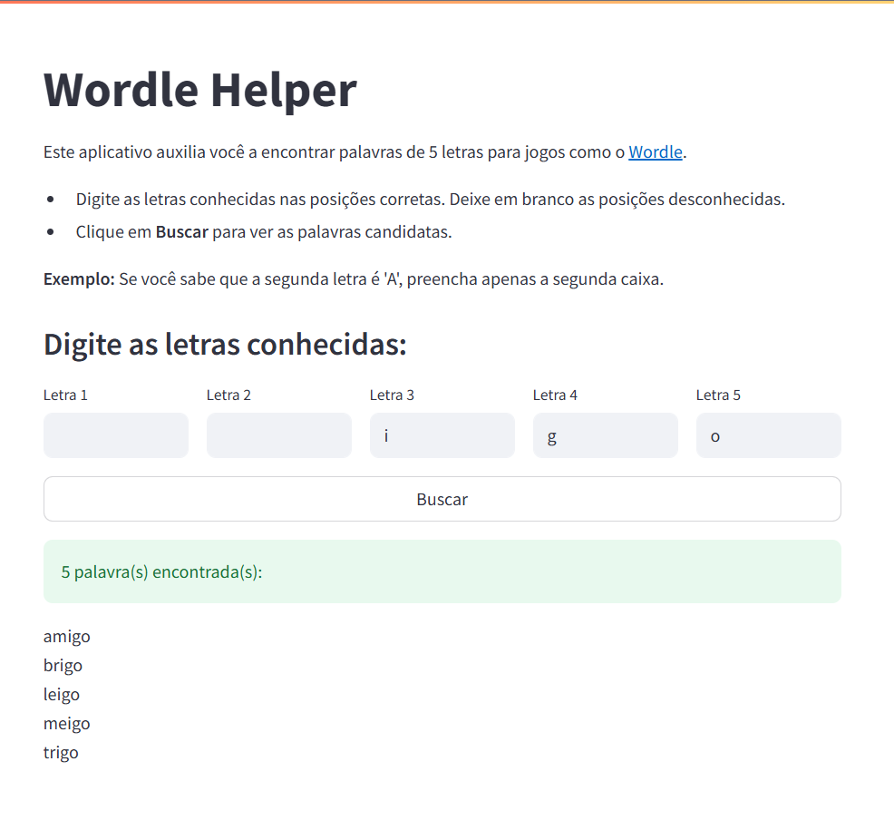

# Wordle Helper

Wordle Helper é um aplicativo simples para ajudar jogadores de jogos como o Wordle a encontrar palavras de 5 letras em português, baseado nas letras conhecidas em cada posição.



Acesse o app no [Streamlit Cloud](https://wordle-helper.streamlit.app/).

## Funcionalidades
- Interface amigável via Streamlit
- Busca rápida de palavras candidatas com base nas letras conhecidas
- Suporte a padrões parciais (deixe caixas em branco para posições desconhecidas)

## Como Usar
1. Abra o app com `streamlit run app.py`.
2. Digite as letras conhecidas nas caixas correspondentes às posições das letras (deixe em branco se não souber).
3. Clique em **Buscar** para ver as palavras candidatas.
4. Use as sugestões para avançar no seu jogo!

### Exemplo
Se você sabe que a segunda letra é 'A', preencha apenas a segunda caixa:

| L1  | L2  | L3  | L4  | L5  |
| --- | --- | --- | --- | --- |
|     | A   |     |     |     |

O app irá mostrar todas as palavras de 5 letras com 'A' na segunda posição.

## Instalação
1. Clone este repositório:
   ```bash
   git clone https://github.com/stevillis/wordle-helper.git
   cd wordle-helper
   ```
2. Crie um ambiente virtual:
   ```bash
   python -m venv venv
   ```
3. Ative o ambiente virtual:
   ```bash
   .\venv\Scripts\activate
   ```
4. Instale as dependências:
   ```bash
   pip install -r requirements.txt
   ```

## Executar o App
1. Execute o app:
```bash
streamlit run app.py
```
2. Acesse `http://localhost:8501` no seu navegador.

## Estrutura do Projeto
```
wordle-helper/
├── app.py                # Interface Streamlit
├── wordle_helper.py      # Funções de busca de palavras
├── test_wordle_helper.py # Testes unitários (pytest)
├── README.md             # Este arquivo
└── br-sem-acentos.txt    # Lista de palavras do português brasileiro.
```

A lista de palavras foi extraída do [repositório IME-USP](https://www.ime.usp.br/~pf/dicios/).

## Testes (opcional)
Para rodar os testes unitários:
```bash
pytest test_wordle_helper.py
```
